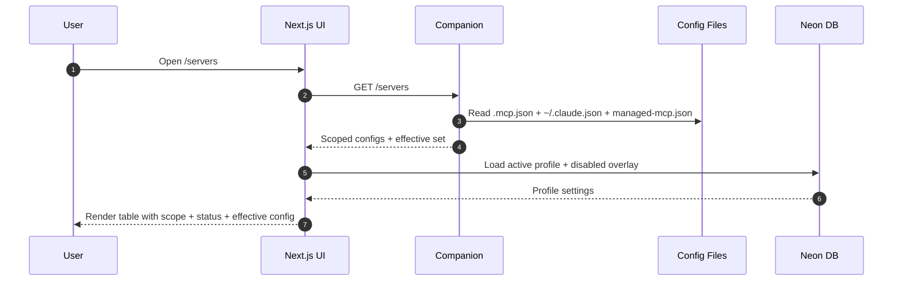
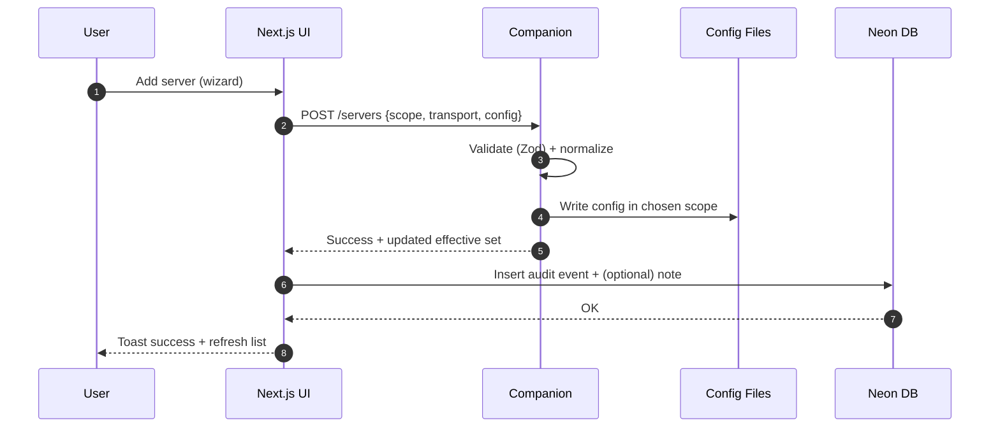
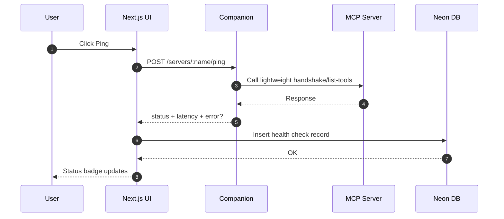

# MCP Manager

A local-first manager for **Claude Code MCP servers**: view, validate, edit, and health-check your MCP configuration across scopes (project/user/enterprise), with profiles and an audit log.

## Technologies used

- Next.js
- shadcn/ui
- Tailwind CSS
- Motion (Framer Motion) for animation
- React Query (TanStack Query)
- Neon DB (Vercel Postgres)

---

## Why a “local companion” exists

A browser-only web app can’t safely read `~/.claude.json` or run `claude mcp ...` on your machine. MCP Manager uses a small **local companion daemon** that runs on `127.0.0.1` and exposes a minimal API to the UI.

- UI: pleasant, reactive, searchable management console
- Companion: filesystem + CLI access, strict validation, no secret leakage
- Neon: persistent overlays (profiles/disabled), health history, audit log

---

## High-level architecture

```mermaid
flowchart LR
  UI[Next.js UI\nshadcn + tailwind + motion\nReact Query] -->|HTTP (localhost)| COMP[Local Companion\nNode/TS daemon]
  COMP -->|read/write| FS[(Local Filesystem)\n.mcp.json\n~/.claude.json\nmanaged-mcp.json]
  COMP -->|optional| CLI[claude CLI\nclaude mcp ...]
  UI -->|DB queries| DB[(Neon Postgres\nvia Vercel)]
  COMP -->|health checks| MCP[(MCP Servers)\nhttp / stdio]
```

Core user flows
1) Load & compute effective configuration



2) Add server (HTTP or stdio) with safe validation



3) Health check (ping)



Features

- Server inventory with scope badges and transport labels
- Effective config computation with precedence explanation
- Add/Edit/Remove servers with diff preview and validation
- Profiles: enable/disable servers per profile (overlay)
- Health checks: latency + last error + history chart
- Audit log: before/after snapshots and timestamps

Repository layout

```txt
apps/web        Next.js UI
apps/companion  Local companion daemon (localhost API)
packages/shared Shared config types + validation + merge logic
```

Getting started

### Prereqs

- Node 20+
- pnpm 9+
- Vercel Postgres (Neon) database URL
- Optional: claude CLI on PATH (recommended)

Install

```bash
pnpm install
```

Configure env

Create .env.local in apps/web:

```bash
DATABASE_URL=postgres://...
NEXT_PUBLIC_COMPANION_URL=http://127.0.0.1:7777
```

Create .env in apps/companion (if needed):

```bash
COMPANION_PORT=7777
# Optional: set CLAUDE_CLI_PATH if not on PATH
# CLAUDE_CLI_PATH=/usr/local/bin/claude
```

Run dev

```bash
pnpm dev
```

Suggested pnpm dev behavior:

- starts apps/companion on localhost
- starts Next.js apps/web

Scripts (recommended)

From repo root:

```bash
pnpm dev           # web + companion
pnpm test          # vitest
pnpm test:e2e      # playwright
pnpm lint
pnpm typecheck
```

Testing

**Unit/component: Vitest**

What we test:

- config merge/precedence
- parsing normalization and validation
- React Query hooks with mocked fetch
- key UI forms (wizard, diff preview) via component tests

Run:

```bash
pnpm test
```

**E2E: Playwright**

What we test:

- list servers -> details
- add server -> ping -> disable -> verify effective set
- edit server -> audit log contains event
- remove server -> disappears

Run:

```bash
pnpm test:e2e
```

Test isolation guidelines:

- point tests to a dedicated test DB URL (separate Neon branch/schema)
- companion uses a temp directory with fixture config files
- truncate DB tables between test runs

**Security notes**

- Never log env var values or secrets
- Companion binds only to 127.0.0.1 by default
- Validate all inputs (Zod) and sanitize outputs
- Enterprise/managed scope is read-only

**Roadmap**

- Import from Claude Desktop configs (one-click)
- Server catalog + install templates
- Better diagnostics (tool output size warnings, retries)
- “Runbook mode”: export effective config + health report for sharing

